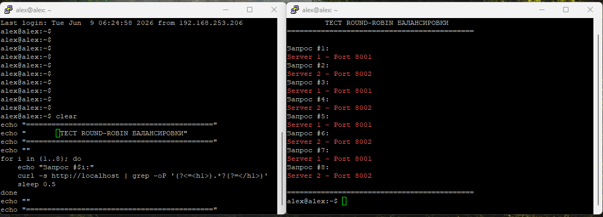
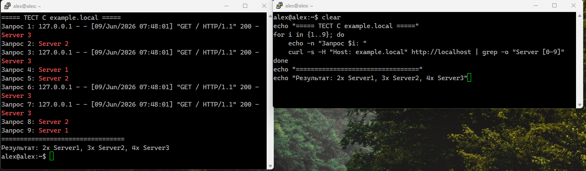
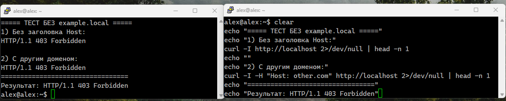

# Домашнее задание к занятию "`Кластеризация и Балансировка Нагрузки `" - `Кононенко Александр`
## Задание1

### Скриншот Решения 

###  конфигурационный файл haproxy добален с названием  haproxy.cfg

## Задание2

### Скриншот Решения
## Cкриншот с Доменом

## скриншот без Домена

###  конфигурационный файл haproxy добален с названием 2_zadaniye_haproxy.cfg

